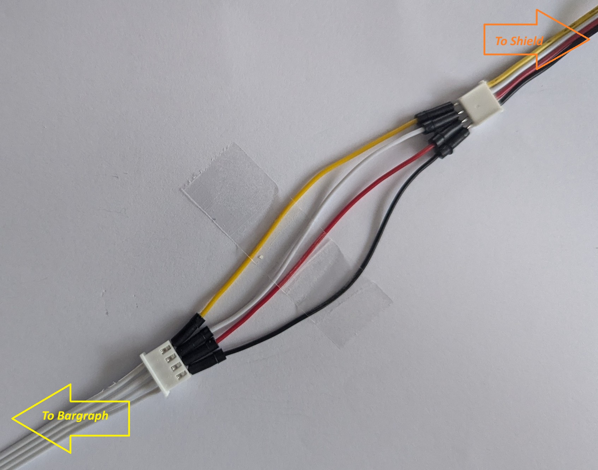
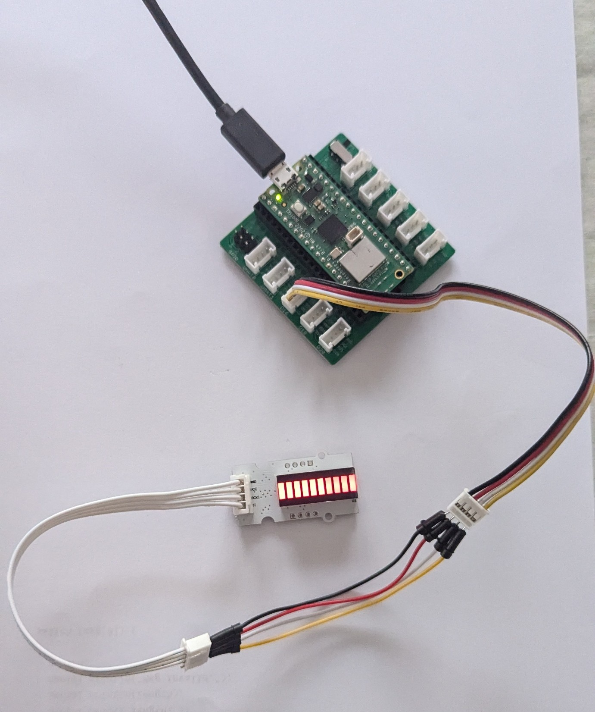

# linksprite.bargraph.rpipico
Arduino Sketch to drive [LinkSprite Bargraph](https://wiki.linksprite.com/index.php?title=LED_Bar&oldid=4543) from a [RPi Pico](https://www.raspberrypi.com/documentation/microcontrollers/pico-series.html) using a [Grove RPi Pico Shield](https://www.seeedstudio.com/Grove-Shield-for-Pi-Pico-v1-0-p-4846.html).

-[Schematics](https://s3.amazonaws.com/linksprite/LinkerKit/LED+Bar.pdf)

I purchased a LinkSprite Bargraph quite cheaply from Jaycar in Australia [linker-led-bar-for-arduino-XC4568](https://www.jaycar.com.au/linker-led-bar-for-arduino/p/XC4568) as it was on significant discount (as of 10/09/24). 
It is a 10 segment LED bar graph. 
Data is serially clocked in, thus requiring only 2 pins, data and clock.
I used the Grove RPi Pico Shield to make the connections easier. 
The third socket at the bottom of the shield was used using GPIO pins 16 (data) and 17 (clock).
A Grove cable was connected to the shield which when jumpered to a LinkSprite cable was connected to the bargraph device. 
Both cables are 4 wire cables with 2 signal wires, power and ground.

## Jumper Connections (Grove Cable)

  - Black  : Ground
  - Red    : 3.3V
  - White  : Data (GPIO 16)
  - Yellow : Clock (GPIO 17)

## Connected Device

As stated previously, the bargrapgh is connected to the third socket at the bottom of the grove shield:  
  
***Linksprite Bargraph to Grove Pico Shield connections***

<iframe src="https://giphy.com/embed/YMj0oajD5xOegzI72A" width="270" height="480" style="" frameBorder="0" class="giphy-embed" allowFullScreen></iframe>
<a href="https://giphy.com/gifs/YMj0oajD5xOegzI72A">via GIPHY</a>

